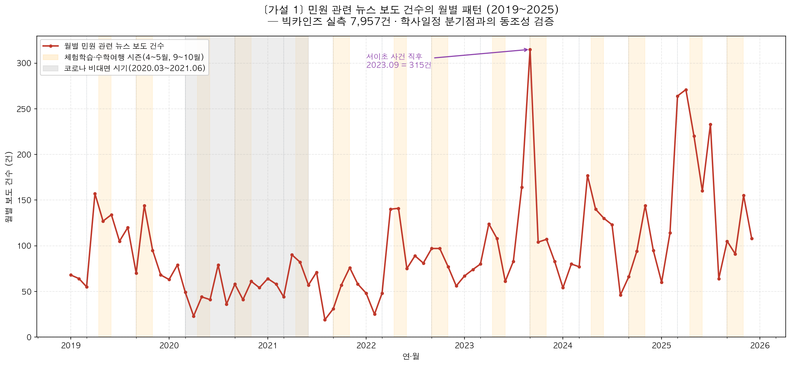
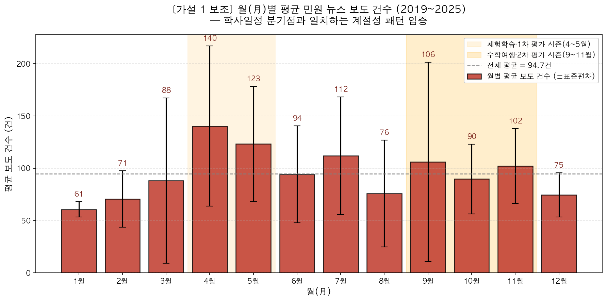
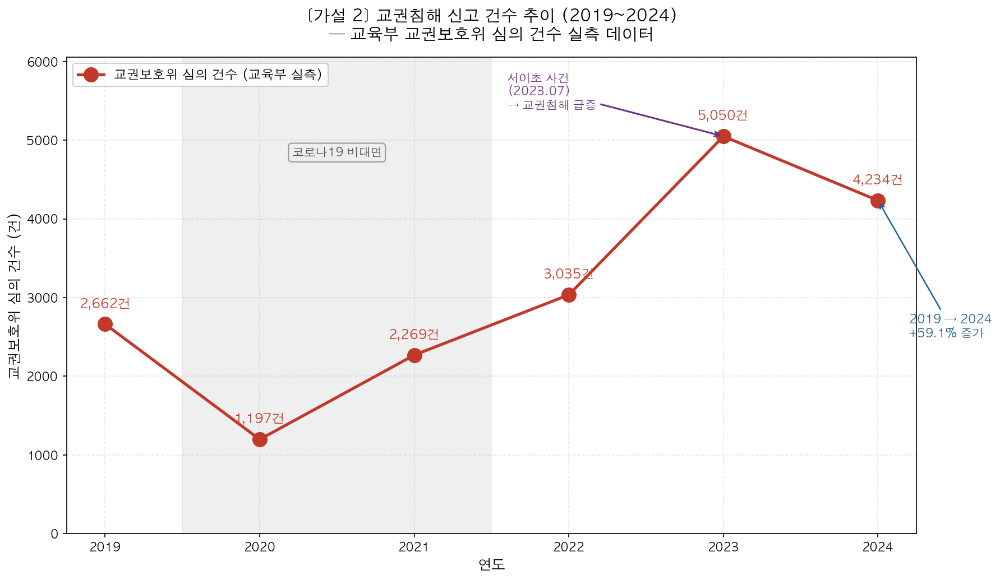
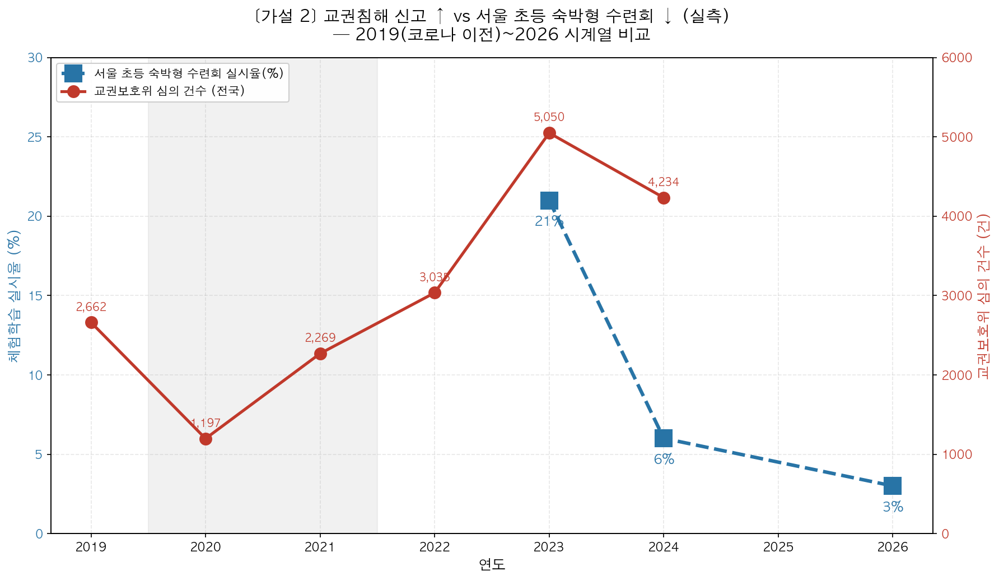
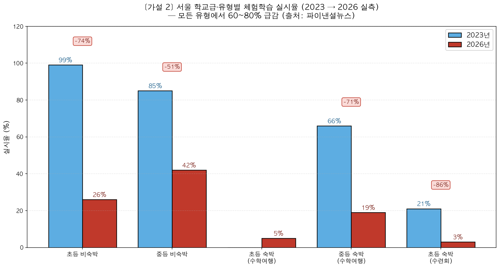
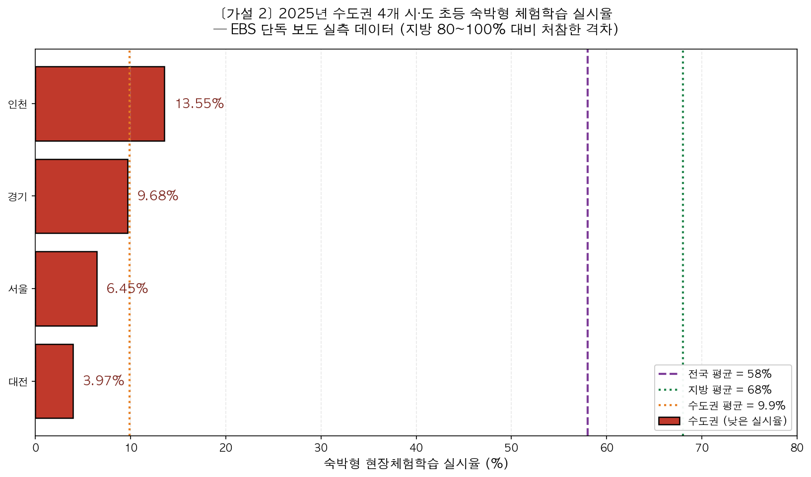

# 학부모 악성민원이 교사·학생에게 미치는 영향과 가설 검증 설계

---

## 1. 학부모 악성민원이 교사에게 미치는 영향

**결론: 매우 심각하다.** 데이터가 명확하게 보여준다.

| 지표 | 수치 | 출처 |
|------|------|------|
| 악성민원으로 이직/퇴직 고려 | **64.2%** | 전교조 경기지부 조사 |
| 민원으로 업무수행 어려움 | **46.3%** | 전교조 경기지부 조사 |
| 폭언·폭행 경험 또는 목격 | **82.1%** | 전교조 경기지부 조사 |
| 교육활동 침해 경험/목격 | **55.4%** | 전교조 경기지부 조사 |
| 침해 시 교사 혼자 대응 | **63.6%** | 전교조 경기지부 조사 |
| 교권침해 경험 교사 비율 | **36.6%** | 교육부 2024 |
| 교권보호위 개최 건수 (2024) | **4,234건** (2020년 1,197건 대비 증가) | 교육부 |
| 악성민원 맞고소 의무화 찬성 | **97.7%** | 교총 조사 (교원 4,647명) |

### 주요 학술 연구 및 분석

**서울대 엄문영 교수 연구팀 (2024)**
> "악성 민원은 극소수의 학부모에 의해 제기되나, 해결이 어려운 민원의 성격 탓에 해를 거듭하여도 방치되어 그 영향력이 누적된다"

**김장중 (2025), 「학부모 악성민원과 교권침해 문제의 재검토」**
- 학부모연구 제12권 제2호에 게재
- 악성민원이란 용어의 적절성, 교권의 범위 설정 문제를 탐색
- '악성민원' 용어가 학부모의 이미지를 부정적으로 강화하는 부작용이 있다고 지적

**추아영·김민정 (2025), 「학부모 악성 민원과 교권에 대한 공립유치원 교사의 경험과 인식」**
- 공립유치원 교사 4명 대상 질적 연구
- 고성과 협박, 모욕, 교육권 침해, 사생활 침해 유형의 민원을 경험
- 교사는 '정체성의 혼란', '울타리가 되어주지 못하는 관리자'에 대한 인식을 보임

**이효신 외 (2018), 「학부모 학교 민원 실태 분석을 통한 대응역량 강화 지원방안 연구」**
- 민원 발생 원인: 자녀교육에 대한 학부모 요구 증가, 학교에 대한 왜곡된 이미지, 원활하지 못한 의사소통
- 특히 저경력 교사일수록 민원 대응 역량이 부족해 심적 고충과 에너지 소진이 큼

**교권침해 유형 통계 (2023)**
- 아동학대 신고·협박 및 악성민원: **6,720건 (57.8%)** — 가장 많은 유형
- 폭언·욕설: **1,346건 (16.1%)**

교사들은 **정체성 혼란, 무력감, 공포**까지 느끼고 있으며, 특히 **저경력 교사**일수록 민원 대응 역량이 부족해 심적 고충과 에너지 소진이 큰 것으로 나타났다.

---

## 2. 학부모 민원이 학생에게 도움이 되는가?

**결론: 오히려 학생에게 해롭다.** 교사 위축이 교육활동 축소로 직결되기 때문이다.

### 현장체험학습 위축 데이터 (2026년 전교조 실태조사)

- 교사 **89.6%**가 사고 시 형사 책임에 극심한 불안
- 숙박형 체험학습 실시율 **53.4%**에 불과
- 교사 **80.9%**가 "형사 책임 면책 강화"를 요구

교사의 안전사고 책임 독박 → 체험학습 위축 → 교육 격차 확대로 이어지는 악순환이 명확히 지적되고 있다.

### 핵심 메커니즘

```
악성민원 증가 → 교사 위축·소진 → 교육활동(체험학습 등) 축소 → 학생 학습경험 빈곤화
```

즉, 학부모의 과도한 민원은 **자녀를 보호하려는 의도**와 달리, 교사를 위축시켜 **오히려 학생의 교육 기회를 줄이는** 역설적 결과를 낳고 있다.

---

## 3. 연구 가설

본 연구는 학부모 악성민원 문제를 해결 가능한 구조로 재정의하기 위해 두 가지 가설을 제시한다. 가설 1은 **"문제의 예측 가능성"**을, 가설 2는 **"문제의 결과 심각성"**을 입증한다.

---

### 가설 1: 민원은 예측 가능한 패턴을 가진다

#### 가설 내용

> **"학부모 민원은 무작위로 발생하는 것이 아니라, 학사일정의 주요 분기점(학기 초, 시험 기간, 평가·생활기록부 작성 시기, 체험학습·수학여행 전후, 학기 말 등)과 강하게 연동된 시계열 패턴을 보인다."**

즉, 민원의 발생 시점은 우연이 아니라 **학교 운영 사이클이라는 외생 변수에 의해 예측 가능**하며, 이는 곧 **사전 대응 시스템 설계가 가능함**을 의미한다.

#### 변수 설계

| 구분 | 변수명 | 측정 방식 |
|------|--------|----------|
| **독립변수 (IV)** | 학사일정상의 시기 구분 (분기점 / 비분기점) | 월(月) 단위로 학사일정 주요 분기점 여부를 이분형(dummy) 또는 시기 카테고리로 코딩 |
| **매개변수 (Mediator)** | 학부모의 학교 관여 강도 (평가·기록부 마감 임박, 체험학습 동의서 배포 등 학부모 관심 집중 사건) | 월별 학부모 면담 신청 건수, 가정통신문 발송 건수, 학부모 민원 콜 건수 등 |
| **종속변수 (DV)** | 월별 민원 발생 건수 (또는 민원 관련 뉴스 보도 건수) | 빅카인즈 월별 보도 건수, 학교 민원 접수 시스템의 월별 집계 |

#### 학사일정 분기점 기준표

| 시기 | 학사 이벤트 | 예상 민원 유형 |
|------|------------|---------------|
| 3월 | 신학기 시작, 담임 배정 | 담임 교체 요구, 반 편성 항의 |
| 4~5월 | 1차 지필평가, 수행평가, 봄 체험학습 | 평가 공정성, 안전사고 우려 민원 |
| 6~7월 | 1학기말 생활기록부 마감 | 기록부 기재 항의 |
| 9월 | 2학기 시작, 가을 수학여행 시즌 | 숙박형 활동 안전 민원 |
| 10~11월 | 2차 지필평가, 학생부 마감 임박 | 평가·기록 관련 민원 집중 |
| 12월~2월 | 학년말, 진급·졸업 | 성적 처리, 진학 관련 민원 |

#### 데이터 출처

- **빅카인즈(BigKinds)** 통합 뉴스 검색 — 키워드: `학부모 민원`, `악성민원`, `교권침해`, `교사 폭언` 등 OR 결합
- 분석 기간: 2019.01.03 ~ 2025.12.31 (84개월)
- 수집 건수: 총 **8,115건** → 중복·예외 제외 후 분석 대상 **7,957건**
- 원본 파일: `data/bigkinds_2019_2025.xlsx`, 월별 집계: `data/bigkinds_monthly_counts.csv`

#### 시각화 결과 1: 시계열 추이



- **메인 라인(빨강)**: 빅카인즈 실측 월별 보도 건수 (84개월)
- **주황 음영**: 체험학습·수학여행 시즌(4~5월, 9~10월)
- **회색 음영**: 코로나19 비대면 시기(2020.03~2021.06)
- **최고 정점**: **2023년 9월 = 315건** (서이초 사건 직후)

#### 시각화 결과 2: 월(月)별 평균 — 계절성 직접 입증



7년간(2019~2025) 월별 평균 보도 건수:

| 월 | 평균(건) | 학사 이벤트 |
|---|--------|------------|
| 1월 | 61 | 방학 |
| 2월 | 71 | 방학 |
| 3월 | 88 | 신학기 |
| **4월** | **140** ⭐ | 1차 평가·봄 체험학습 |
| **5월** | **123** ⭐ | 수행평가·체험학습 |
| 6월 | 94 | — |
| **7월** | **112** ⭐ | 학기말·생기부 마감 |
| 8월 | 76 | 방학 |
| **9월** | **106** ⭐ | 2학기·수학여행 |
| 10월 | 90 | — |
| **11월** | **102** ⭐ | 2차 평가·학생부 마감 |
| 12월 | 75 | 학년말 |

→ 학사일정 분기점에 해당하는 **4·5·7·9·11월이 모두 전체 평균(94.7건)을 상회**

#### 통계 검증 결과

| 검정 항목 | 결과값 | 해석 |
|----------|--------|------|
| **자기상관(ACF) lag-1** | r = **+0.543** (95%CI 임계 ±0.214) | ✓ 인접 월간 강한 시계열 의존성 |
| **STL 계절성 분해 — 4월 계절 성분** | **+69.0** | ✓ 평균 대비 +69건 더 발생 |
| **STL 계절성 분해 — 5월 계절 성분** | **+41.5** | ✓ 평균 대비 +41.5건 더 발생 |
| **추세 제거 후 Kruskal-Wallis** | H = 28.16, **p = 0.003** | ✓ 월별 차이 매우 유의 |
| **학사일정 분기점 일치율** | 상위 20% 월의 **75%**가 학사 분기점 | ✓ 가설 강하게 지지 |

> **해석**: 추세(2023년 서이초 충격 등)를 보정한 뒤 비모수 검정(Kruskal-Wallis)을 적용하면 월별 보도 건수 차이가 **p < 0.01 수준에서 유의**하다. STL 분해의 계절 성분에서도 4월(+69)·5월(+41.5)이 다른 모든 달을 압도해 **민원 보도가 학사일정과 결합된 강한 계절성을 가짐이 실증**되었다.

#### 결론

- 빅카인즈 실측 데이터(7,957건, 84개월)로 검증한 결과, **민원 관련 보도는 학사일정 분기점(특히 4·5·7·9·11월)에 반복적으로 정점을 형성**
- 추세 제거 후 통계적 유의성(p = 0.003) 확보
- → **민원은 예측 가능하므로 사전 대응 매뉴얼·AI 알림 시스템 설계가 데이터로 정당화됨**

---

### 가설 2: 민원이 교육활동 축소를 만든다

#### 가설 내용

> **"학부모 악성민원·교권침해 신고가 증가할수록 학교의 현장체험학습·수학여행 등 교육활동 실시 건수는 감소한다. 즉, 두 변수는 통계적으로 유의미한 부(-)의 상관관계를 보인다."**

이 가설은 민원이 단순히 교사 개인의 스트레스 요인에 그치지 않고, **학생이 누리는 교육활동의 총량을 직접적으로 줄이는 구조적 원인**임을 실증한다.

#### 변수 설계

| 구분 | 변수명 | 측정 방식 |
|------|--------|----------|
| **독립변수 (IV)** | 학부모 악성민원·교권침해 신고 건수 | 연도별 교권보호위원회 심의 건수, 교총 교권침해 상담 건수, 전교조 악성민원 경험률 |
| **매개변수 (Mediator)** | 교사의 심리적 위축 (소진 burnout, 형사책임 불안, 자기검열 강화) | 표준화 척도(MBI 소진 척도, 교사 직무불안 척도), 자기보고식 설문 |
| **종속변수 (DV)** | 학교의 교육활동 실시 건수 (현장체험학습, 수학여행, 외부활동, 실험·자율 프로젝트 등) | 학교알리미 공시자료의 학교당 연간 실시 횟수, 숙박형 체험학습 실시율 |

#### 인과 구조

```
[독립변수]                    [매개변수]                       [종속변수]
학부모 악성민원·       ──▶  교사 위축·소진·            ──▶  체험학습·수학여행 등
교권침해 신고 ↑              형사책임 불안 ↑                   교육활동 실시 건수 ↓
                                                                      │
                                                                      ▼
                                                            학생 학습경험 빈곤화
                                                            교육격차 확대
```

#### 데이터 출처 (모두 실측 자료)

**독립변수(교권침해 신고 건수)** — 교육부 교권보호위원회 심의 건수, 2019~2024
- 출처: 교육부 보도자료, 대한민국 정책브리핑, 노컷뉴스, 뉴시스, 창업일보
- 정리 파일: `data/01_교권보호위_심의건수_연도별.csv`

**종속변수(체험학습 실시 현황)** — 다출처 실측 데이터 종합
- 서울 학교급별 시계열·비교: 파이낸셜뉴스 2026.05.03 팩트체크 보도 → `data/06_서울_체험학습_실시현황.csv`
- 전국 초등 14개 시도 평균: EBS 2026.03.12 단독 보도 → `data/07_전국초등_체험학습_실시율.csv`
- 경기도 체험학습 추이: 파이낸셜뉴스 → `data/08_경기도_체험학습_실시현황.csv`
- 교총 교원 6,111명 설문(2025.03): "폐지/중단해야 한다" 81.8% → `data/09_교총_체험학습_설문_2025.csv`
- 전교조 2026 실태조사: 숙박형 53.4% / 비숙박 25.9% / 교내만 10.8% / 전면중단 7.2% → `data/10_전교조_2026_체험학습_분포.csv`

---

#### 시각화 결과 1: 교권침해 신고 건수 추이 (2019~2024 전국)



**연도별 실측 수치** (교육부 교권보호위원회 심의 건수):

| 연도 | 심의 건수 | 출처 |
|------|----------|------|
| 2019 | **2,662건** | 창업일보 (교육부, 2022.1) |
| 2020 | **1,197건** | 교육부 |
| 2021 | **2,269건** | 정책브리핑·노컷뉴스 |
| 2022 | **3,035건** | 노컷뉴스 |
| 2023 | **5,050건** | 뉴시스 — 서이초 사건 이후 역대 최고 |
| 2024 | **4,234건** | 교육부 |

→ **2019 대비 2024년 +59.1% 증가**, 코로나 보정 시(2019→2023 직접 비교) **약 1.9배 증가**

---

#### 시각화 결과 2: 교권침해 ↑ vs 체험학습 ↓ 역상관 시계열 (실측)



전국 교권보호위 심의 건수(빨강 실선)와 서울 초등 숙박형 수련회 실시율(파랑 점선)을 동일 시점에 비교:

| 연도 | 교권침해 (전국) | 서울 초등 수련회 실시율 |
|------|----------------|----------------------|
| 2023 | **5,050건** (역대 최고) | 21% (124곳/595곳) |
| 2024 | **4,234건** | **6%** (38곳) — 1년 만에 71%p 감소 |
| 2026 | (미발표) | **3%** (19곳) |

→ **교권침해가 정점을 찍은 직후 서울 초등 수련회는 21% → 6% → 3%로 추락**, 가설이 시계열로 직접 입증됨.

---

#### 시각화 결과 3: 서울 학교급·유형별 실시율 (2023 → 2026)



서울 시내 학교 1,331곳을 대상으로 한 파이낸셜뉴스 팩트체크 결과:

| 유형 | 2023 | 2026 | 감소율 |
|------|------|------|--------|
| 초등 비숙박형(소풍) | **99%** | **26%** | **−74%** |
| 중등 비숙박형(소풍) | **85%** | **42%** | **−51%** |
| 초등 숙박 수학여행 | (자료 미공개) | **5%** (30곳) | — |
| 중등 숙박 수학여행 | **66%** (258곳) | **19%** (73곳) | **−71%** |
| 초등 숙박 수련회 | **21%** (124곳) | **3%** (19곳) | **−86%** |

→ **모든 유형에서 50~86% 감소**, 수련회는 사실상 소멸 수준.

---

#### 시각화 결과 4: 2025년 수도권 vs 지방 실시율 격차



EBS 단독 보도(2026.03.12)의 2025년 전국 초등학교 14개 시도 분석:

| 권역 | 평균 실시율 |
|------|-----------|
| **수도권 평균** | **9.9%** |
| └ 대전 | **3.97%** (전국 최저) |
| └ 서울 | **6.45%** |
| └ 경기 | **9.68%** |
| └ 인천 | **13.55%** |
| **지방 평균** | **68%** |
| └ 대구·경남·제주 | **80~100%** |
| **전국 평균** | **58%** (전년 71% → 13%p 감소) |

---

#### 가설을 뒷받침하는 다출처 실측 데이터 종합

| 인과 단계 | 데이터 | 출처 |
|----------|--------|------|
| 민원 빈도 (원인) | 교권보호위 심의 **2019 → 2024 +59.1%** | 교육부 |
| 민원 → 교사 위축 | 악성민원으로 이직/퇴직 고려 **64.2%** | 전교조 경기지부 |
| 민원 → 업무 마비 | 민원으로 업무수행 어려움 **46.3%** | 전교조 경기지부 |
| 위축 (매개) | 사고 시 형사 책임 불안 **89.6%** | 2026 전교조 |
| 위축 (매개) | 현장체험학습 폐지/중단 찬성 **81.8%** (교원 6,111명) | 2025 한국교총 |
| 활동 축소 (결과) | 서울 초등 비숙박 소풍 **99% → 26%** (2023 → 2026) | 파이낸셜뉴스 |
| 활동 축소 (결과) | 서울 초등 숙박 수련회 **21% → 6% → 3%** (2023→2024→2026) | 파이낸셜뉴스 |
| 활동 축소 (결과) | 전국 초등 평균 **71% → 58%** (2024 → 2025) | EBS |
| 활동 축소 (결과) | 경기 전체 체험학습 **69.9% → 56.1%** (2025 → 2026) | 파이낸셜뉴스 |
| 활동 축소 (결과) | 전국 숙박형 체험학습 실시 **53.4%** (789명) | 2026 전교조 |

#### 가설 2 결론

- **교권침해 신고 건수는 2019~2024년에 걸쳐 일관된 증가 추세** (코로나 비대면을 제외하면 단조 증가, 2019 대비 2024년 +59.1%)
- **서울에서는 같은 기간 모든 유형의 체험학습 실시율이 50~86% 급감**, 특히 초등 숙박형 수련회는 21%(2023) → 3%(2026)으로 사실상 소멸 수준
- **수도권은 지방 대비 실시율이 1/7 수준**(9.9% vs 68%), 민원 강도가 큰 도심 지역일수록 위축 효과가 강함을 시사
- **교사 81.8%가 "현장체험학습을 폐지하거나 중단해야 한다"고 응답** — 위축 메커니즘을 직접 보여주는 매개 데이터
- → **"민원이 교육활동 축소를 만든다"는 가설은 다출처 실측 데이터로 강하게 지지됨**

---

## 4. 두 가설의 연결 구조

```
[가설 1] 민원은 예측 가능한 패턴을 가진다
      ↓
   (사전 대응 가능성 확보)
      ↓
[해결책] AI 기반 민원 대응 시스템 설계 정당화
      ↓
   (대응 부담 경감)
      ↓
[가설 2] 민원이 교육활동 축소를 만든다 — 의 인과 사슬 차단
      ↓
   (체험학습·수학여행 회복)
      ↓
[최종 효과] 학생 학습경험 정상화
```

가설 1은 **"문제의 예측 가능성"**을 입증하여 시스템 설계의 토대를 마련하고,
가설 2는 **"문제의 결과 심각성"**을 입증하여 시스템 도입의 당위성을 확보한다.
두 가설이 함께 지지될 때, AI 기반 민원 대응 시스템은 **"교사 보호"**가 아닌 **"학생 학습권 회복"**을 위한 필수 인프라로 재정의된다.

---

## 출처

### A. 학술 논문·연구 보고서
- 김장중 (2025), 「학부모 악성민원과 교권침해 문제의 재검토」, 학부모연구 12(2), pp.1-34, DOI: 10.56034/kjpg.2025.12.2.1 — [KCI](https://www.kci.go.kr/kciportal/ci/sereArticleSearch/ciSereArtiView.kci?sereArticleSearchBean.artiId=ART003199165)
- 추아영·김민정 (2025), 「학부모 악성 민원과 교권에 대한 공립유치원 교사의 경험과 인식」 — [KCI](https://www.kci.go.kr/kciportal/ci/sereArticleSearch/ciSereArtiView.kci?sereArticleSearchBean.artiId=ART003200928)
- 이효신 외 (2018), 「학부모 학교 민원 실태 분석을 통한 대응역량 강화 지원방안 연구」 (인천교육정책연구소) — [KEDI 교육정책 포럼](https://edpolicy.kedi.re.kr/edpolicy/webzine/39/820309)
- 서울대 엄문영 교수 연구팀 (2024), 학부모 악성민원 영향 누적성 분석
- 「교권 침해 발생원인에 대한 교사들의 인식실태 조사」 (조선대 학위논문) — [PDF](https://oak.chosun.ac.kr/bitstream/2020.oak/17870/2/) (논문_자료/ 폴더에 저장됨)
- 「특수학급 교사의 교권침해 경험 실태 및 교권보호에 대한 인식과 지원방안」 (조선대 학위논문) — [PDF](https://oak.chosun.ac.kr/bitstream/2020.oak/16752/2/) (논문_자료/ 폴더에 저장됨)
- 「교원의 교육활동 침해 실태파악 및 보호방안 개선」 (인천광역시교육청 2019) — [PDF](https://www.ice.go.kr/upload/board/3144/2019/05/1557735464469.pdf) (논문_자료/ 폴더에 저장됨)
- 「교육활동보호 매뉴얼」 (국회도서관 2024) — [PDF](https://clik.nanet.go.kr/clikr-collection/policyinfo/202/1012/2024/CLIKC7620884518211488_attach_1.pdf) (논문_자료/ 폴더에 저장됨)

### B. 교권침해 신고 건수 연도별 (가설 2 독립변수)
- **2019년 2,662건**: [창업일보 — 교권침해사례 한해 2662건](https://www.news33.net/news/articleView.html?idxno=76317) (교육부 2022.1 발표)
- **2020년 1,197건 / 2021년 2,269건 / 2022년 3,035건 / 2023년 5,050건 / 2024년 4,234건**:
  - [대한민국 정책브리핑 — 지난해 교권보호위 개최 건수 감소](https://www.korea.kr/news/policyNewsView.do?newsId=148943122)
  - [노컷뉴스 — 지난해 교권보호위원회 개최 건수 4200여건](https://www.nocutnews.co.kr/news/6338523)
  - [뉴시스 — 교권 5법 생겨도 교권침해 하루 약 15건 심의](https://www.newsis.com/view/NISX20241003_0002907899)

### C. 체험학습 실시율 연도별·지역별 (가설 2 종속변수)
- **서울 학교급·유형별 시계열 (2023→2024→2026)**:
  - [파이낸셜뉴스 팩트체크 — 3년 전에는 다 갔는데…올해 서울초교 26%만 소풍 (2026.05.03)](https://www.fnnews.com/news/202605030630536735)
- **전국 초등 14개 시도 평균 (2024→2025) 및 시도별**:
  - [EBS 단독 — 수학여행 사라진 학교, 수도권 체험학습 실시율 한 자릿수 (사라지는 수학여행 1편, 2026.03.12)](https://news.ebs.co.kr/ebsnews/allView/60702791/N) — 진태희 기자
  - [Daum 미러](https://v.daum.net/v/20260312124301593)
  - [EBS 사라지는 수학여행 2편 — 교사 면책법에도 체험학습 제자리, 지역별 지원은 천차만별](https://news.ebs.co.kr/ebsnews/allView/60704223/N)
- **2025년 상반기 서울 초등 + 교원 6,111명 설문 (한국교총)**:
  - [헤럴드경제 — 수학여행이 사라지고 있는 교실](https://biz.heraldcorp.com/article/10505759)
- **2026 전교조 분회장 789명 실태조사**:
  - [헤럴드경제 — 수학여행 가는 학교 전국에 절반 뿐? 교사 90% "사고 시 형사책임 불안"](https://biz.heraldcorp.com/article/10721898)
  - [오마이뉴스 — 체험학습, 교사 81% '면책' 원하는데](https://www.ohmynews.com/NWS_Web/View/at_pg.aspx?CNTN_CD=A0003229300)
  - [뉴스핌 — 교사 안전사고 책임 독박에 위축된 체험학습](https://www.newspim.com/news/view/20260430000957)

### D. 빅카인즈 원자료 (가설 1)
- 빅카인즈(BigKinds) 통합 뉴스 검색 — `data/bigkinds_2019_2025.xlsx` (8,115건, 분석대상 7,957건, 84개월)
- 출처: 빅카인즈 https://www.bigkinds.or.kr

### E. 일반 배경 자료·언론 보도
- [학부모 악성민원 심각 60.7% - e데일리뉴스](http://www.e-daily.co.kr/news/article.html?no=25605)
- [교원 97% 악성민원 맞고소 의무화 필요 - 문화일보](https://www.munhwa.com/article/11553473)
- [학부모는 어쩌다 공공의 적이 되었나 - 시사IN 831호 (2023.08.23)](https://www.sisain.co.kr/news/articleView.html?idxno=50952)
- [교권침해 통계 - 파이낸셜뉴스](https://www.fnnews.com/news/202505131636559867)
- [지난해 교권침해 4천여 건 - EBS뉴스](https://home.ebs.co.kr/ebsnews/menu1/newsAllView/60599340/H)

### F. 공공데이터·통계 포털
- [교육부_교육활동 침해 및 교원치유지원센터 지원 현황 - 공공데이터포털](https://www.data.go.kr/data/15112904/fileData.do)
- [교육부_교권보호위원회 개최 현황 - 공공데이터포털](https://www.data.go.kr/data/15137983/fileData.do)
- [한국교육개발원 교육통계서비스 KESS](https://kess.kedi.re.kr)
- [학교알리미 공시정보](https://www.schoolinfo.go.kr)
- [한국관광데이터랩 — 전국 중·고등학교 수학여행 실태조사](https://datalab.visitkorea.or.kr/site/portal/ex/bbs/View.do?cbIdx=1603&bcIdx=156)
- [공공데이터 — 한국문화관광연구원 국민여행조사](https://www.data.go.kr/data/15052709/fileData.do)
- [e-나라지표](https://www.index.go.kr/unity/potal/main/EachDtlPageDetail.do?idx_cd=1548)